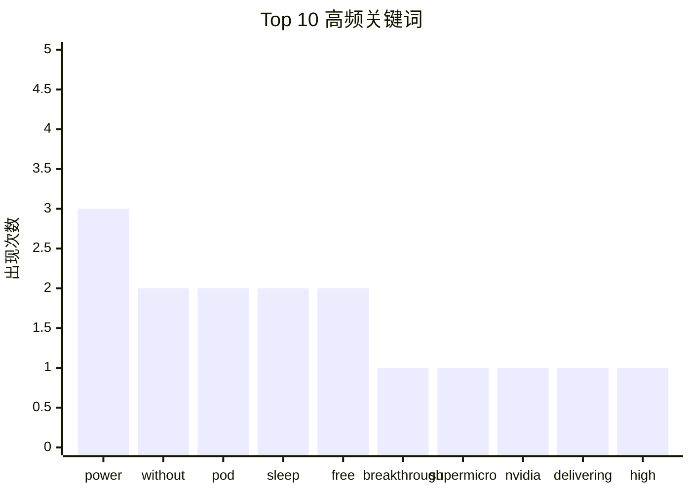

# AI 选题报告 - 2026-02-21

## 摘要
- **扫描推文**: 30
- **筛选后**: 30
- **推荐选题**: 5

---

## 🔥 互动热度 Top 3

| 排名 | 作者 | 互动总量 | 内容预览 | 链接 |
|------|------|----------|----------|------|
| 1 | @NBCOlympics | 8,142 | Team USA RUNNING away with it!... | [🔗]() |
| 2 | @Supermicro | 2,801 | Power your next AI breakthrough with Sup... | [🔗]() |
| 3 | @ridgewallet | 345 | Fit 10,000mAh in the palm of your hand. ... | [🔗]() |

---

## 📊 关键词词频统计

| 关键词 | 出现次数 |
|--------|----------|
| power | 3 |
| without | 2 |
| pod | 2 |
| sleep | 2 |
| free | 2 |
| breakthrough | 1 |
| supermicro | 1 |
| nvidia | 1 |
| delivering | 1 |
| high | 1 |

---

## Top 5 选题推荐

### 1. Power your next AI breakthrough with Supermicro an

**作者**: @Supermicro (Supermicro) | **分类**: 未分类

**原文内容**:
> Power your next AI breakthrough with Supermicro and NVIDIA, delivering high‑density compute optimized for training and inference.
> 
> Modernize your data center with our AI Factory solutions.

**互动数据**: ❤️ 2,409 | 🔄 303 | 💬 89 | 👀 33,042,567
**发布时间**:  | 🔗 [查看原帖]()
**标签**: 原创

---

### 2. Team USA RUNNING away with it!

**作者**: @NBCOlympics (NBC Olympics & Paralympics) | **分类**: 未分类

**原文内容**:
> Team USA RUNNING away with it!

**互动数据**: ❤️ 7,570 | 🔄 493 | 💬 79 | 👀 7,502,502
**发布时间**:  | 🔗 [查看原帖]()
**标签**: 原创

---

### 3. Fit 10,000mAh in the palm of your hand. One thing 

**作者**: @ridgewallet (Ridge) | **分类**: 未分类

**原文内容**:
> Fit 10,000mAh in the palm of your hand. One thing to pack, five ways to power.

**互动数据**: ❤️ 305 | 🔄 17 | 💬 23 | 👀 2,764,228
**发布时间**:  | 🔗 [查看原帖]()
**标签**: 原创

---

### 4. Unleash the power to create without limits with Al

**作者**: @altium (Altium) | **分类**: 未分类

**原文内容**:
> Unleash the power to create without limits with Altium Develop. Unlock multidisciplinary product creation powered by a network without constraints.

**互动数据**: ❤️ 172 | 🔄 24 | 💬 0 | 👀 1,092,971
**发布时间**:  | 🔗 [查看原帖]()
**标签**: 原创

---

### 5. Save up to $200 off the Pod  Add clinically proven

**作者**: @eightsleep (Eight Sleep) | **分类**: 未分类

**原文内容**:
> Save up to $200 off the Pod
> 
> Add clinically proven better sleep to your mattress
> 30-Night risk-free trial
> Free shipping & returns
> 
> The Pod transforms any bed into an adaptive environment, adjusting temperature to maximize sleep.
> 
> Terms and conditions apply.

**互动数据**: ❤️ 15 | 🔄 2 | 💬 0 | 👀 459,580
**发布时间**:  | 🔗 [查看原帖]()
**标签**: 原创

---

*生成于 2026-02-21 12:59 | 扫描 30 条 → 精选 5 条*
*由公众号「懂点儿AI」开发维护，如有问题或建议欢迎关注公众号反馈 💡*
